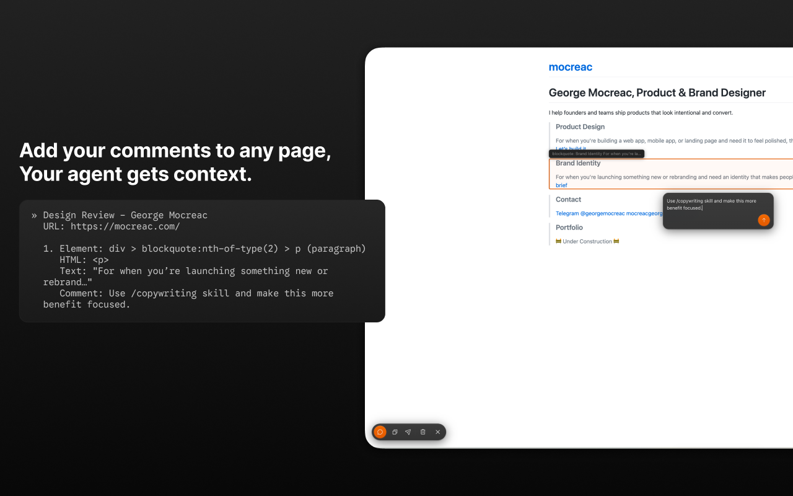

# Agimut



Annotate any live web page. Copy the output. Paste it into Claude Code, Codex, or whatever agent you use. It knows exactly what to fix.

Agimut is a Chrome extension that lets you pin comments on UI elements and export them as structured text with CSS selectors, HTML tags, and page context. Built for teams that use AI coding agents in their review workflow.

## Install

**Chrome Web Store:** [Agimut](https://chromewebstore.google.com/detail/kjkhilpfobeadgnhnoomknmblnccakmf)

**Manual install:**

1. Clone this repo
2. Open `chrome://extensions`
3. Enable **Developer mode**
4. Click **Load unpacked** and select the repo directory


## Why??

Instead of describing UI issues in words and hoping the agent finds the right element, you annotate it directly and the export bridges the gap between what you see in the browser and what the agent sees in your code.

Agimut is designed for AI-assisted workflows. Tools like Claude Code, Cursor, and Codex can read the structured output and immediately understand what you're pointing at. Each annotation gives them:

- **CSS selectors** that map directly to elements in your source code
- **Rendered HTML with classes** that work across any framework — Tailwind, CSS modules, styled-components
- **Ancestor trail** showing where the element sits in the page structure
- **Viewport size** so the agent knows which breakpoint you were reviewing at
- **Your comments** explaining what needs to change and why


## How it works

1. Click the Agimut icon to activate
2. Hover over any element to see it highlighted with its element type
3. Click to pin a comment
4. Hit **A** to copy all annotations
5. Paste into your agent, ticket, or chat

Each annotation captures the CSS selector, the element's opening HTML tag (with all classes and attributes), and a text preview. An AI agent reading the export can see exactly which element you're referring to and map it back to your source code.

## Export format

```
Design Review - Page Title
URL: https://example.com/page
Viewport: 1440×900

1. [list item] nav.main-nav > ul > li:nth-of-type(3)
   In: nav
   HTML: <li class="flex items-center gap-6 px-4 py-2 text-sm">
   Text: "Products"
   Comment: Spacing between nav items is inconsistent, should be 16px

2. [heading 1] #hero-heading
   In: main > section
   HTML: <h1 class="text-5xl font-light text-gray-700">
   Text: "Welcome to Our Platform"
   Comment: Font weight looks lighter than the design spec
```

The viewport line helps AI agents understand which breakpoint you were reviewing at. The HTML tag line is what makes this work across any framework. Tailwind, CSS modules, BEM, styled-components - the agent sees the actual classes on the rendered element and can grep your codebase for them.

## Keyboard shortcuts

| Key | Action |
|---|---|
| **C** | Toggle comment mode |
| **A** | Copy all annotations |
| **Shift+A** | Copy all & clear |
| **XXX** | Delete all annotations |
| **Z** | Undo delete (5s window) |
| **Esc** | Close / exit comment mode |

### Keyboard navigation

Keyboard navigation is enabled by default. Toggle it in the in-page menu (click the sliders icon on the toolbar). When active in comment mode:

| Key | Action |
|---|---|
| **Arrow keys** | Move selection spatially (up/down/left/right) |
| **Shift+Up/Down** | Select parent or child element |
| **Tab / Shift+Tab** | Cycle through elements in DOM order |
| **Enter** | Annotate the selected element |

This lets you select a card container vs. the text inside it, which matters for precise design review.

## Latest updates (v1.1)

- Toast notifications — copy, clear, and delete actions show a brief confirmation toast above the toolbar
- Toggle badge — annotation count badge appears on the toggle button when the toolbar is closed
- Floating annotation navigator — click any pin or the count badge to open a prev/next pill; arrow left/right to navigate between annotations
- Orphaned annotations — when a page changes and an annotated element is gone, the pin snaps to the top-left with a "not found" indicator and the original selector for debugging
- Keyboard navigation on by default — arrow keys, parent/child, and Tab cycling work immediately in comment mode
- Scroll/resize performance — rAF-throttled repositioning with cached navigable elements
- Hash-based SPA routing — annotations persist per hash route on single-page apps
- localStorage LRU cleanup — caps stored pages at 50, evicts oldest by last-access timestamp
- Unified glass UI — tooltip, toast, and nav pill share a consistent dark glass style with backdrop blur

## License

MIT
